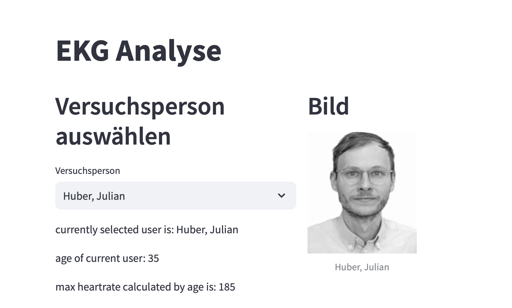
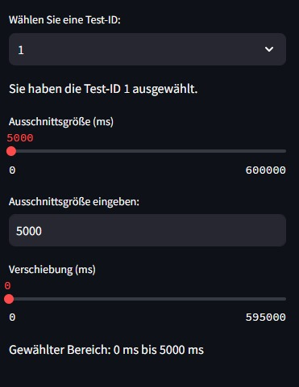
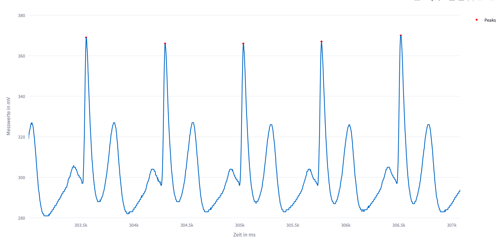
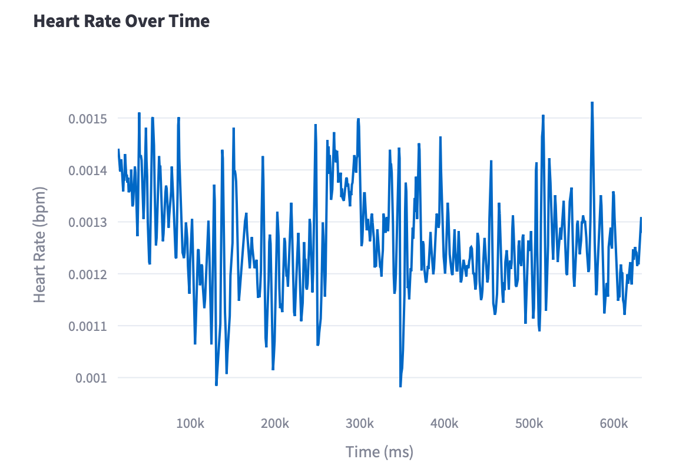

- venv Ordner erstellen: main.py -> rechts unten auf Zahlen -> in Suchleiste den Venv Ordner anklicken

- venv aktivieren, um in die Umgebung verschiedene Sachen installieren -> in Kommandozeile erscheint grünes Venv und dann kann man mit pip install ... das gewünschte installieren

- read_data.py : json datei-> Funktion, die datei einließt -> dictionary mit der Person erstellt -> Funktion: nur den Firstname extrahiert-> Einer leeren Liste werden die Namen übergeben -> Funktion die die namen anzeigt

- öffnen der Webseite: Im Terminal: streamlit run main.py 

-pip freeze > requirements.txt

# Ziel der Anwendung
Die Anwendung ermöglicht die Analyse von EKG-Daten, indem sie dem Benutzer erlaubt, Versuchspersonen auszuwählen und spezifische Ausschnitte ihrer EKG-Daten visuell zu untersuchen.
Ziel ist es, eine benutzerfreundliche Oberfläche zur Analyse und Visualisierung von EKG-Daten bereitzustellen, um Einblicke in die Herzaktivität der Versuchspersonen zu gewinnen.

## Funktionen der Anwendung
### Versuchsperson auswählen: 
Eine Versuchsperson kann aus der Dropdown-Liste auf der linken Seite ausgewählt werden.
### Bild und Informationen: 
Ein Bild der ausgewählten Versuchsperson sowie einige grundlegende Informationen wie Alter und maximal berechnete Herzfrequenz werden angezeigt.
### Test-ID auswählen: 
Man wählt eine Test-ID aus der Dropdown-Liste, um die entsprechenden EKG-Daten zu laden.
### EKG-Daten anzeigen: 
Die EKG-Daten der ausgewählten Test-ID werden als Plot dargestellt, der die Herzaktivität über die Zeit zeigt.
### Herzfrequenz schätzen:
Peaks in den EKG-Daten werden erkannt und zur Schätzung der Herzfrequenz verwendet. Diese Herzfrequenz wird ebenfalls als Plot dargestellt.
### Ausschnittsgröße anpassen: 
Man kann die Größe des angezeigten EKG-Ausschnitts mit einem Slider oder durch Eingabe einer genauen Zahl anzeigen lassen.
### Bereich verschieben: 
Man kann den angezeigten Bereich entlang der EKG-Grafik verschieben, um verschiedene Teile der Daten zu sehen.

# Installation & Nutzung
1. Klonen Sie das Repository:
```ruby
git clone https://github.com/IhrBenutzername/ekg-analyse-app.git
```

3. mit folgendem Befehl können Sie die benötigten Bibliotheken installieren:
```ruby
pip install -r requirements.txt
```

4. Starten Sie die App mit folgendem Befehl:
```ruby
streamlit run main.py
```
### benötigte Bibliotheken
- pandas
- streamlit
- PIL
- scipy
- plotly
- json
- weitere Bibliotheken Kathrin

### Dateien
- main.py: Hauptdatei der Anwendung.
- read_data.py: Skript zum Einlesen der Personendaten.
- person.py: Modul zur Verwaltung der Personendaten.
- ekgdata.py: Modul zur Verarbeitung und Visualisierung der EKG-Daten.
- data/person_db.json: Beispielhafte JSON-Datei mit den Personendaten.

## Beispiel
Hier ist ein Beispiel - Screenshot der Anwendung in Aktion:
Beispiel Person: Huber, Julian






## Feedback 🗣️
Falls Sie Probleme beim Installieren oder Verwenden der Anwendung haben oder Verbesserungsvorschläge haben, zögeren Sie nicht, ein Issue im Repository zu öffnen oder eine E-Mail an: ag9716@mci4me.at, ge7045@mci4me.at oder an: gk2575@mci4me.at zu senden.

**_Viel Spaß beim Experimentieren!_** 🦾 💻 📈


