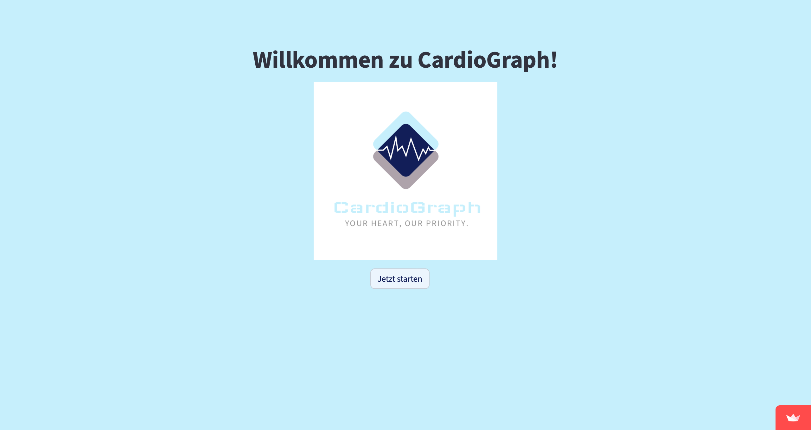
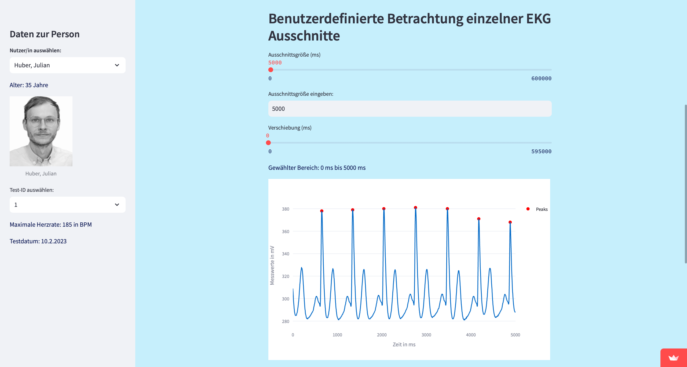
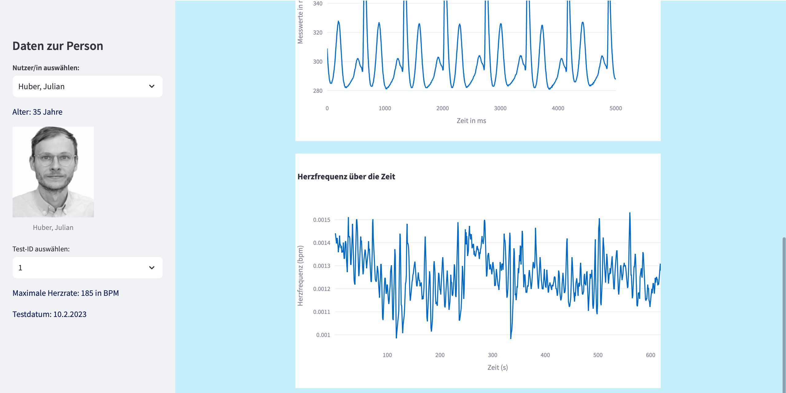
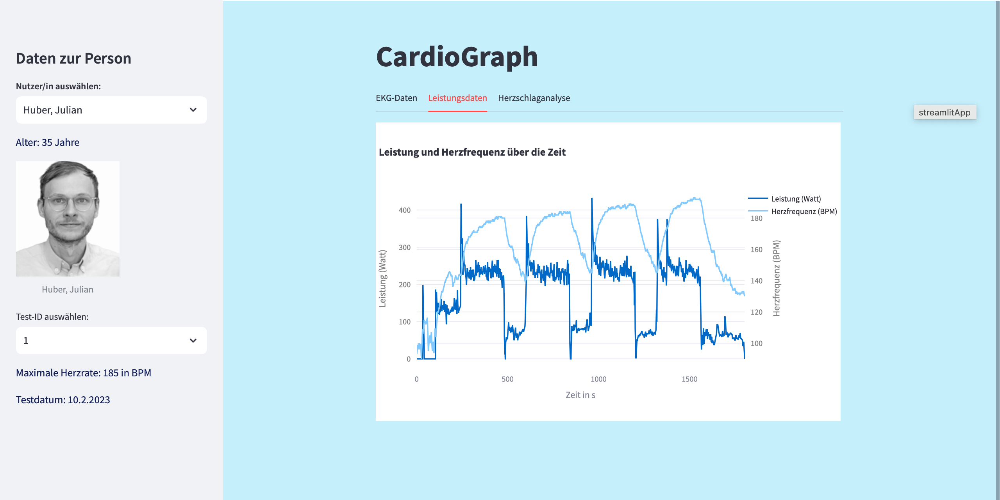
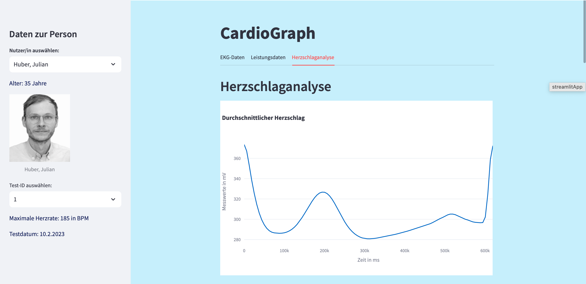
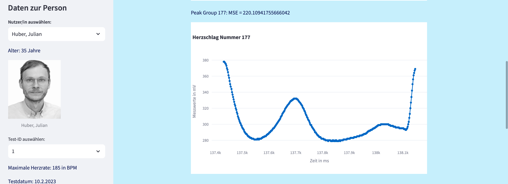
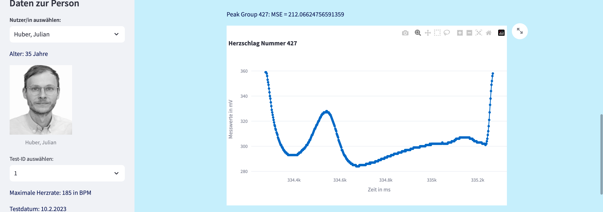
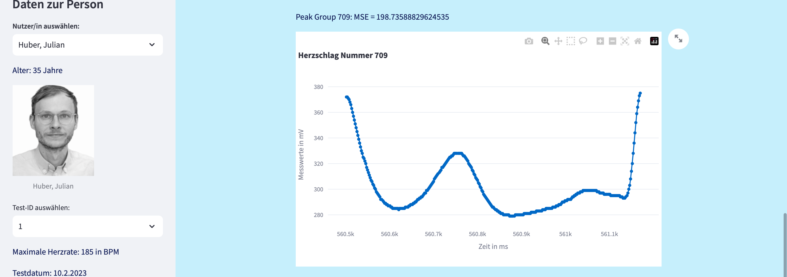
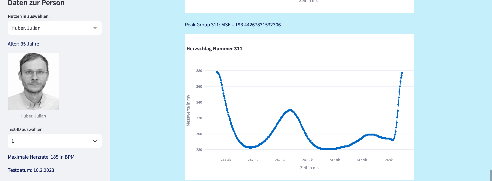

# CardioGraph 📈
*YOUR HEART, OUR PRIORITY*


## Einführung
Willkommen bei CardioGraph! Diese benutzerfreundliche, Streamlit-basierte Webanwendung wurde entwickelt, um Ihnen die Analyse und Visualisierung von EKG-Daten zu erleichtern. CardioGraph ermöglicht Ihnen, EKG-Daten zu untersuchen, Herzaktivitäten zu analysieren und wertvolle Einblicke in die Herzgesundheit zu gewinnen.


## Zielgruppe
Diese Anwendung richtet sich an:

- **medizinische Fachkräfte:** zur klinischen Diagnostik und Überwachung der Herzgesundheit.
  
- **Forscher im Bereich Kardiologie:** zur Analyse großer Datensätze und Identifikation von Mustern.
  
- **Sportwissenschaftler:** zur Überwachung der Herzaktivität von Athleten und Analyse der Trainingseffekte.


## Funktionen der Anwendung
### Willkommensseite
- **Begrüßungstext und Bild:** Eine freundliche Einführung in die Anwendung.
  
- **Button "Jetzt Starten"**:
  >⚠️**WICHTIG:**
  >Doppelklicken Sie auf diesen Button, um zur Analyse-Seite zu gelangen.


### EKG-Analyse-Seite
#### Sidebar

- **Versuchsperson auswählen:**
  Wählen Sie eine Versuchsperson aus der Dropdown-Liste.
  
- **Bild und Informationen:**
  Anzeigen eines Bildes und grundlegender Informationen (Alter, maximale Herzfrequenz) der ausgewählten Versuchsperson.
  
- **Test-ID auswählen:**
  Wählen Sie eine Test-ID, um die entsprechenden EKG-Daten zu laden.


#### Tab1: EKG-Daten
- **EKG-Daten anzeigen:**
  Plot des gesamten EKG-Datensatzes der ausgewählten Test-ID, der die Herzaktivität über die Zeit zeigt.
  
- **Herzfrequenz schätzen:**
  Erkennung von Peaks in den EKG-Daten zur Schätzung der Herzfrequenz, dargestellt in einem separaten Plot.
  
- **Ausschnittsgröße anpassen:**
  Passen Sie die Größe des angezeigten EKG-Ausschnitts mittels Slider oder Eingabe einer genauen Zahl an.
  
- **Bereich verschieben:**
  Verschieben Sie den angezeigten Bereich entlang der EKG-Grafik zur Untersuchung verschiedener Datenteile.


#### Tab 2: Leistungsdaten
- **Leistungsdaten visualisieren:**
  Laden und Visualisieren der Leistungsdaten der ausgewählten Versuchsperson.


#### Tab 3: Herzschlaganalyse
- **Durchschnittlicher Herzschlag:**
  Der durchschnittliche Herzschlag wird berechnet und geplottet.
  
- **Vergleich der Herzschläge mit dem Durchschnitt:**
  Die Herzschläge werden mit dem durchschnittlichen Herzschlag verglichen und die Ergebnisse werden angezeigt.


## Zugang zur Anwendung
Sie können direkt auf die Webanwendung zugreifen, indem Sie die folgende URL besuchen:
(https://ekg-app-entwicklung-kg-eg-ga.streamlit.app/)


## Installation & Nutzung
1. Klonen Sie das Repository:
```ruby
git clone https://github.com/IhrBenutzername/ekg-analyse-app.git
```

2. Installieren Sie die benötigten Bibliotheken mit folgendem Befehl:
```ruby
pip install -r requirements.txt
```

3. Starten Sie die App mit folgendem Befehl:
```ruby
streamlit run main.py
```

## benötigte Bibliotheken
- pandas
- streamlit
- PIL
- scipy
- plotly
- json
- signal
- dtw
- numpy


## Dateien
- main.py: Hauptdatei der Anwendung.
- read_data.py: Skript zum Einlesen der Personendaten.
- person.py: Modul zur Verwaltung der Personendaten.
- ekgdata.py: Modul zur Verarbeitung und Visualisierung der EKG-Daten und der Herzschlaganalyse.
- data/person_db.json: Beispielhafte JSON-Datei mit den Personendaten.
- activity_analyse.py: Interaktiver Plot zur Leistung über die Zeit.
- dataframe_plot.py: Modul zur Erstellung von Plots aus DataFrames.
- power_data.py: Modul zur Verarbeitung von Leistungsdaten.
- requirements.txt: Liste der benötigten Bibliotheken.


## Beispiel
Hier ist ein Beispiel - Screenshot der Anwendung in Aktion:
Beispiel Person: Huber, Julian












## Erweiterung: Detaillierte Herzschlaganalyse
Diese Erweiterung ermöglicht eine detaillierte Analyse der Herzschläge. Sie berechnet den durchschnittlichen Herzschlag eines Tests und identifiziert die fünf Herzschläge mit den größten Abweichungen vom Durchschnitt, welche in einem Plot dargestellt werden. Dies kann besonders nützlich sein, um potenzielle Herzfehler oder andere Unregelmäßigkeiten zu erkennen.


### Methodenbeschreibung
- *heartbeat_deviation(beat1, beat2)*:
  Berechnet die Abweichungen zwischen zwei Herzschlägen anhand der Messwerte in Millivolt (mV). Diese Methode filtert die Daten für den ersten und zweiten Herzschlag und gibt einen DataFrame zurück, der nur die Daten des ersten Herzschlags enthält.
  
- *heartbeat_determine()*:
  Fügt dem vorhandenen DataFrame 'self.df' eine Spalte "Beat" hinzu, die jeden Herzschlag mit einer eindeutigen Nummer markiert (Peak Group). Diese Methode iteriert über die Daten und weist jeder Zeile basierend auf den Peaks eine entsprechende Gruppennummer zu.
  
- *plot_heartbeat(number)*:
  Plottet den Herzschlag mit der angegebenen Gruppennummer 'number'. Die Methode filtert den DataFrame 'self.df' nach der entsprechenden Peak Group, um die Daten zu extrahieren, und erstellt einen interaktiven Liniengraphen mit Plotly, der die Herzschlagdaten über die Zeit (in ms) darstellt.

- *heartbeat_avg(resample_length=100)*:
  Berechnet den durchschnittlichen Herzschlag aus den vorhandenen Herzschlägen. Zuerst werden alle Herzschläge in einer Liste extrahiert und auf die Länge des Referenzherzschlags resampled. Dann wird der durchschnittliche Herzschlag berechnet und in einem neuen DataFrame 'self.avg_df' gespeichert.

- *plot_avg_hb()*:
  Plottet den durchschnittlichen Herzschlag aus 'self.avg_df'. Die Methode erstellt einen interaktiven Liniengraphen mit Plotly, der den durchschnittlichen Herzschlag über die Zeit darstellt.

- *compare_with_avg(num_beats=5)*:
  Vergleicht die vorhandenen Herzschläge mit dem durchschnittlichen Herzschlag. Alle Herzschläge werden auf die Länge des durchschnittlichen Herzschlags resampled. Dann wird der mittlere quadratische Fehler (MSE) zwischen jedem resampled Herzschlag und dem durchschnittlichen Herzschlag berechnet. Die Herzschläge werden nach dem MSE-Wert absteigend sortiert, und die Top num_beats Herzschläge mit den größten Abweichungen werden zurückgegeben und geplottet.


### Anwendungsbeispiel
Der durchschnittliche Herzschlag wird berechnet, um Herzschläge zu identifizieren, die möglicherweise auf Herzfehler oder andere Unregelmäßigkeiten hinweisen könnten.
Der Prozess umfasst drei Schritte:

1. **Resampling:** Die Länge des durchschnittlichen Herzschlags wird als Referenz genommen. Alle anderen Herzschläge werden auf diese Länge resampled.
   
2. **Vergleich:** Zwei Arrays werden erstellt – eines mit dem durchschnittlichen Herzschlag und eines mit allen anderen Herzschlägen. Diese Arrays werden verwendet, um den mittleren quadratischen Fehler (MSE) zu berechnen, was die Grundlage für die Identifikation der Herzschläge mit den größten Abweichungen bildet.
   
3. **Plotten der kritischsten Herzschläge:** Die Herzschläge mit den höchsten MSE-Werten werden identifiziert und geplottet, um visuell überprüft zu werden.

## Feedback 🗣️ & Kontaktinformationen
Falls Sie Probleme beim Installieren oder Verwenden der Anwendung haben oder Verbesserungsvorschläge haben, zögeren Sie nicht, ein Issue im Repository zu öffnen oder eine E-Mail an das Entwicklerteam unter : ag9716@mci4me.at, gk2575@mci4me.at oder ge7045@mci4me.at zu senden.


Wir hoffen, dass CardioGraph Ihnen dabei hilft, tiefere Einblicke in die Herzgesundheit zu gewinnen und eine wertvolle Ressource für Ihre medizinischen, sportlichen oder wissenschaftlichen Analysen darstellt.

***Viel Spaß beim Erkunden und Analysieren Ihrer EKG-Daten mit CardioGraph!🦾 💻 📈***
